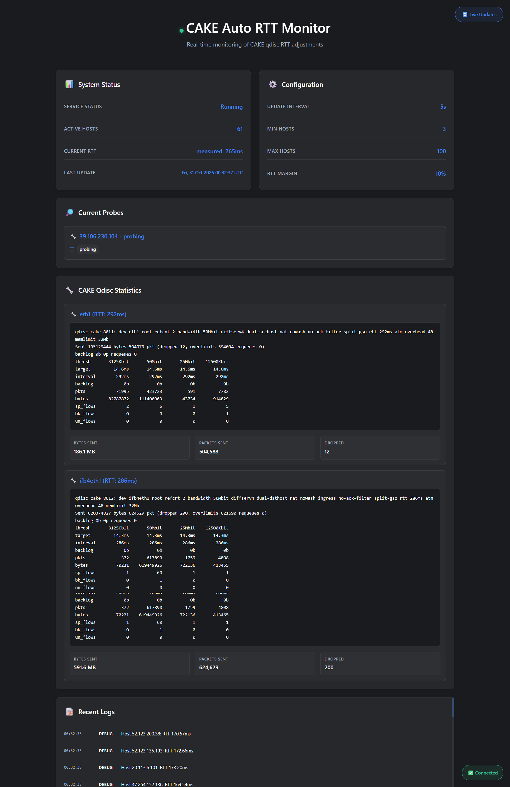

# OpenWrt 安装指南

**语言:** [English](README_OpenWrt.md) | [中文](README_OpenWrt_zh.md)

**主要 README:** [English](README.md) | [中文](README_zh.md)

本指南展示如何在 OpenWrt 上安装 cake-autortt，支持**全自动安装**和 YAML 配置。

## 🚀 自动化本地编译安装（推荐）

我们强烈建议在 OpenWrt 设备上本地编译并安装该项目。这能为目标环境构建完全兼容的二进制文件，并避免预编译产物在不同系统上导致的问题。

1. 在设备上克隆仓库或将源码复制到设备：

```bash
git clone https://github.com/galpt/go-cake-autortt.git
cd go-cake-autortt
```

2. 赋予安装脚本可执行权限：

```bash
chmod +x install.sh install-compile.sh uninstall.sh
```

3. 以 root 身份运行编译并安装脚本：

```bash
./install-compile.sh
```

该脚本会尝试通过 `opkg` 或在支持的架构上下载 Go 二进制包来安装 Go，随后编译源码并安装生成的二进制及 OpenWrt 服务脚本。

## 🚀 自动安装（推荐）

在 OpenWrt 上安装 cake-autortt 最简单的方法是使用自动安装脚本：

```bash
# 以 root 身份运行（OpenWrt 上无需 sudo）
curl -fsSL https://raw.githubusercontent.com/galpt/go-cake-autortt/main/install.sh | ash
```

### 安装脚本的功能

1. ✅ **检查依赖项**：验证 `tc` 和 `wget`/`curl` 是否可用
2. ✅ **下载二进制文件**：获取适合您 OpenWrt 架构的正确 MIPS 二进制文件
3. ✅ **安装二进制文件**：将其放置在 `/usr/bin/cake-autortt` 并设置正确权限
4. ✅ **自动检测接口**：扫描现有的 CAKE qdisc 接口
5. ✅ **创建配置**：生成包含检测到设置的 `/etc/cake-autortt.yaml`
6. ✅ **安装服务**：创建 `/etc/init.d/cake-autortt` 服务脚本
7. ✅ **启用自动启动**：配置服务在启动时自动运行
8. ✅ **启动服务**：立即启动服务
9. ✅ **显示状态**：显示管理命令和 Web 界面 URL

### 安装后操作

安装完成后：
- **Web 界面**：通过 `http://路由器IP:11111` 访问
- **服务状态**：使用 `/etc/init.d/cake-autortt status` 检查
- **配置**：如需要可编辑 `/etc/cake-autortt.yaml`

## 📋 手动安装

如果您偏好手动安装：

### 1. 下载并安装二进制文件

```bash
# 适用于 MIPS 架构（大多数 OpenWrt 路由器）
wget https://github.com/galpt/go-cake-autortt/releases/latest/download/cake-autortt-linux-mips.tar.gz
tar -xzf cake-autortt-linux-mips.tar.gz
cp cake-autortt-linux-mips /usr/bin/cake-autortt
chmod 755 /usr/bin/cake-autortt

# 对于其他架构，检查：uname -m
# 可用架构：mips, mipsle, mips64, mips64le, arm64, armv7, armv6
```

### 2. 创建配置文件

```bash
cat > /etc/cake-autortt.yaml << 'EOF'
# RTT 测量设置
rtt_update_interval: 5        # qdisc RTT 更新间隔（秒）
min_hosts: 3                  # RTT 计算所需的最小主机数
max_hosts: 100                # 同时探测的最大主机数
rtt_margin_percent: 10        # 添加到测量 RTT 的百分比边距
default_rtt_ms: 100           # 无主机可用时的默认 RTT
tcp_connect_timeout: 3        # RTT 测量的 TCP 连接超时
max_concurrent_probes: 50     # 最大并发 TCP 探测数

# 网络接口（配置您的 CAKE 接口）
dl_interface: ""              # 下载接口（例如 "ifb-wan"）
ul_interface: ""              # 上传接口（例如 "wan"）

# 日志记录
debug: false                  # 启用调试日志

# Web 界面
web_enabled: true             # 启用 Web 服务器
web_port: 11111               # Web 服务器端口
EOF
```

### 3. 配置接口

查找您的 CAKE 接口并更新配置：

```bash
# 列出具有 CAKE qdisc 的接口
tc qdisc show | grep cake

# 示例输出：
# qdisc cake 8001: dev ifb-wan root refcnt 2 bandwidth 100Mbit
# qdisc cake 8002: dev wan root refcnt 2 bandwidth 20Mbit

# 使用您的接口编辑配置
vi /etc/cake-autortt.yaml
# 设置：
# dl_interface: "ifb-wan"
# ul_interface: "wan"
```

### 4. 创建服务脚本

```bash
cat > /etc/init.d/cake-autortt << 'EOF'
#!/bin/sh /etc/rc.common
# cake-autortt - 自动调整 CAKE qdisc RTT 参数

START=99
USE_PROCD=1

PROG="/usr/bin/cake-autortt"
CONF="/etc/cake-autortt.yaml"

validate_config() {
	# 检查 tc 是否可用
	command -v tc >/dev/null 2>&1 || {
		echo "错误：需要 tc（流量控制）但未安装"
		return 1
	}
	
	# 检查配置文件是否存在
	if [ ! -f "$CONF" ]; then
		echo "错误：未找到配置文件 $CONF"
		return 1
	fi
	
	return 0
}

start_service() {
	validate_config || return 1
	
	procd_open_instance
	procd_set_param command "$PROG"
	procd_append_param command --config "$CONF"
	
	procd_set_param pidfile /var/run/cake-autortt.pid
	procd_set_param stdout 1
	procd_set_param stderr 1
	procd_set_param respawn ${respawn_threshold:-3600} ${respawn_timeout:-5} ${respawn_retry:-5}
	
	echo "使用配置启动 cake-autortt：$CONF"
	procd_close_instance
}

stop_service() {
	echo "停止 cake-autortt"
}

reload_service() {
	stop
	start
}

service_triggers() {
	procd_add_reload_trigger "cake-autortt"
}
EOF

chmod +x /etc/init.d/cake-autortt
```

### 5. 启用并启动服务

```bash
# 启用开机自启动
/etc/init.d/cake-autortt enable

# 启动服务
/etc/init.d/cake-autortt start

# 检查状态
/etc/init.d/cake-autortt status
```

## ⚙️ 配置

### 配置文件：`/etc/cake-autortt.yaml`

配置使用 YAML 格式（类似于 AdGuard Home）：

```yaml
# RTT 测量设置
rtt_update_interval: 5        # qdisc RTT 更新间隔（秒）
min_hosts: 3                  # RTT 计算所需的最小主机数
max_hosts: 100                # 同时探测的最大主机数
rtt_margin_percent: 10        # 添加到测量 RTT 的百分比边距
default_rtt_ms: 100           # 无主机可用时的默认 RTT
tcp_connect_timeout: 3        # RTT 测量的 TCP 连接超时
max_concurrent_probes: 50     # 最大并发 TCP 探测数

# 网络接口（安装时自动检测）
dl_interface: "ifb-wan"       # 具有 CAKE qdisc 的下载接口
ul_interface: "wan"           # 具有 CAKE qdisc 的上传接口

# 日志记录
debug: false                  # 启用调试日志

# Web 界面
web_enabled: true             # 启用 Web 服务器
web_port: 11111               # Web 服务器端口
```

### 接口检测

**自动检测（推荐）：**
安装脚本自动检测具有 CAKE qdisc 的接口。

**手动配置：**
```bash
# 查找 CAKE 接口
tc qdisc show | grep cake

# 常见的 OpenWrt 接口模式：
# dl_interface: "ifb-wan"    # 下载整形（IFB 接口）
# ul_interface: "wan"        # 上传整形（WAN 接口）
# ul_interface: "eth1"       # 替代 WAN 接口
```

## 🎯 服务管理

```bash
# 启动服务
/etc/init.d/cake-autortt start

# 停止服务
/etc/init.d/cake-autortt stop

# 重启服务
/etc/init.d/cake-autortt restart

# 检查状态
/etc/init.d/cake-autortt status

# 启用开机自启动
/etc/init.d/cake-autortt enable

# 禁用自启动
/etc/init.d/cake-autortt disable

# 查看日志
logread | grep cake-autortt

# 实时跟踪日志
logread -f | grep cake-autortt
```

## 📊 监控

### Web 界面

通过以下地址访问 Web 界面：`http://路由器IP:11111`

功能：
- 实时 RTT 测量
- CAKE qdisc 统计信息
- 实时系统日志
- 接口状态
- 配置概览



### 命令行监控

```bash
# 启用调试日志
vi /etc/cake-autortt.yaml
# 设置：debug: true

# 重启服务以应用更改
/etc/init.d/cake-autortt restart

# 查看调试日志
logread | grep cake-autortt
```

### 手动测试

```bash
# 测试配置
/usr/bin/cake-autortt --config /etc/cake-autortt.yaml --debug

# 检查 CAKE qdisc 状态
tc qdisc show | grep cake

# 监控 RTT 变化
logread -f | grep "Adjusted CAKE RTT"
```

## 🔍 故障排除

### 常见问题

**1. 服务无法启动：**
```bash
# 检查服务状态
/etc/init.d/cake-autortt status

# 检查配置
/usr/bin/cake-autortt --config /etc/cake-autortt.yaml --debug

# 验证配置文件是否存在
ls -la /etc/cake-autortt.yaml
```

**2. 未检测到 CAKE 接口：**
```bash
# 检查是否配置了 CAKE qdisc
tc qdisc show | grep cake

# 如果未找到 CAKE，请配置它（示例）：
tc qdisc add dev wan root cake bandwidth 100mbit
tc qdisc add dev ifb-wan root cake bandwidth 100mbit
```

**3. Web 界面无法访问：**
```bash
# 检查服务是否运行
/etc/init.d/cake-autortt status

# 检查防火墙（如果启用）
iptables -L | grep 11111

# 测试本地访问
wget -O- http://localhost:11111 2>/dev/null | head
```

**4. 无 RTT 测量：**
```bash
# 检查 conntrack
ls -la /proc/net/nf_conntrack

# 检查是否正在提取主机
logread | grep "Extracted.*hosts"

# 启用调试模式以获取详细日志
vi /etc/cake-autortt.yaml  # 设置 debug: true
/etc/init.d/cake-autortt restart
```

### 调试命令

```bash
# 检查系统信息
uname -a
cat /etc/openwrt_release

# 检查网络接口
ip link show

# 检查 CAKE 配置
tc qdisc show
tc -s qdisc show | grep -A5 cake

# 检查活动连接
head -10 /proc/net/nf_conntrack

# 直接测试二进制文件
/usr/bin/cake-autortt --version
/usr/bin/cake-autortt --help
```

### 服务问题的手动解决方案

**如果安装后服务无法自动启动**，您可以手动在后台运行程序：

```bash
# 1. 克隆仓库
git clone https://github.com/galpt/go-cake-autortt.git
cd go-cake-autortt

# 2. 使脚本可执行
chmod +x install.sh uninstall.sh

# 3. 运行安装脚本
./install.sh

# 4. 如果服务无法自动启动，手动在后台运行
/usr/bin/cake-autortt &

# 5. 停止后台进程
killall cake-autortt

# 6. 完全卸载
./uninstall.sh
```

**注意**：`&` 符号使进程在后台运行，允许您继续使用终端。

## 🔄 配置更改

修改 `/etc/cake-autortt.yaml` 后：

```bash
# 重启服务以应用更改
/etc/init.d/cake-autortt restart

# 验证更改是否生效
logread | tail -20 | grep cake-autortt
```

## 🚀 YAML 配置的优势

- **简单**：无 UCI 复杂性，只需编辑 YAML 文件
- **可移植**：在所有 Linux 发行版中使用相同的配置格式
- **可靠**：无需在 UCI 和 YAML 之间进行格式转换
- **熟悉**：像 AdGuard Home 和其他现代服务一样工作
- **自动检测**：安装脚本自动配置接口
- **零接触**：完全自动化的安装和服务设置

## 📞 支持

如果遇到问题：

1. **检查日志**：`logread | grep cake-autortt`
2. **手动测试**：`/usr/bin/cake-autortt --config /etc/cake-autortt.yaml --debug`
3. **重新安装**：再次运行安装脚本（它会备份现有配置）
4. **报告问题**：[GitHub Issues](https://github.com/galpt/go-cake-autortt/issues)

---

**更多信息请参见主要的 [README.md](README.md)**